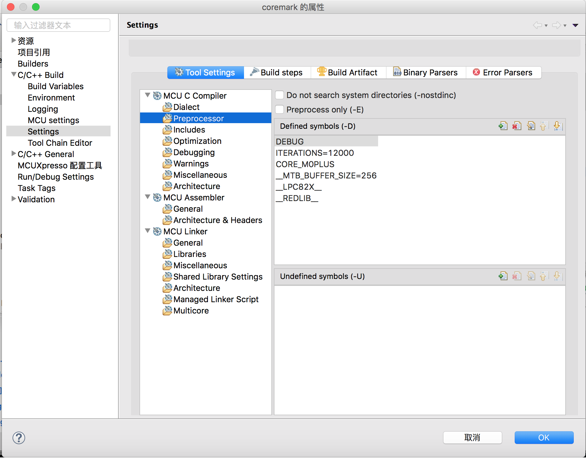
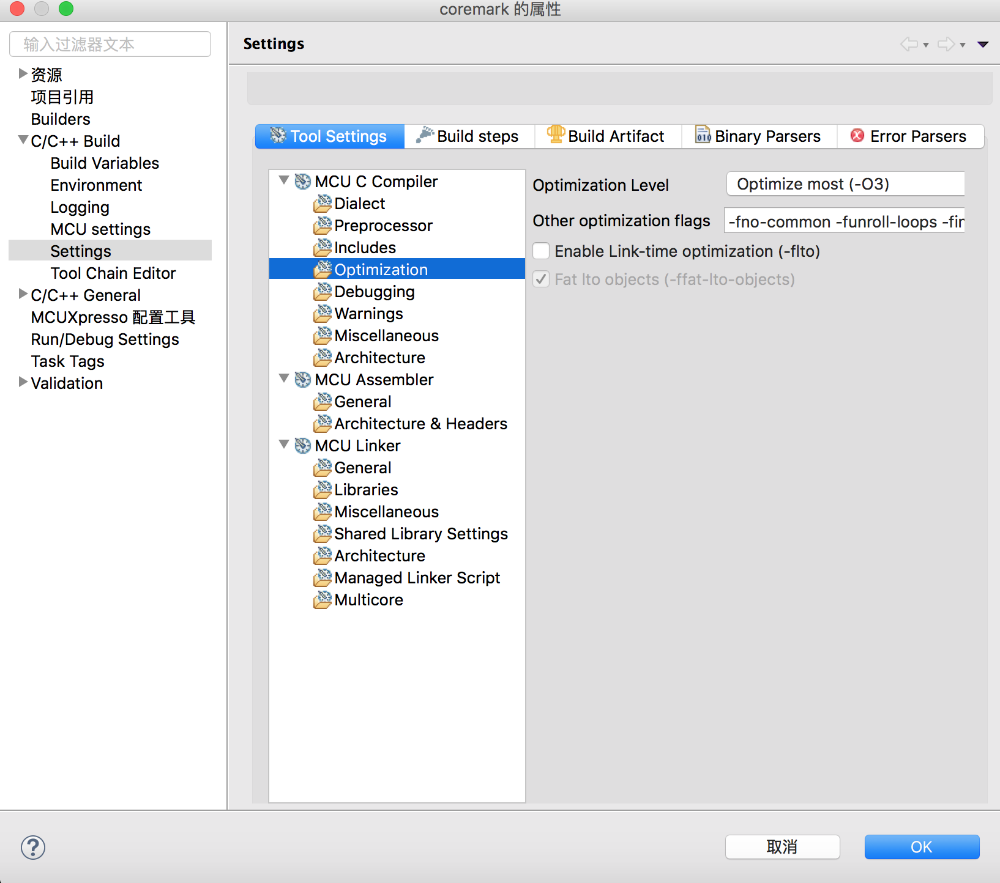

【LPC824Lite】coremark移植与跑分
=======
NXP社区已有人分享了LPC54114的coremark移植和跑分，但还没有在MCUXpressoIDE移植过，这也是申请试用LPC824Lite开发板主要原因。由于有过在NUCLEO-L432KC移植的经历，LPC824Lite的移植也比较顺利，现把这个过程分享一下。
## 下载coremark源码
[在eembc官网下载源码](https://www.eembc.org/coremark/download.php)
 需要注册有些不方便，可以网上搜索下载分享的源码，在github网也能下载，也可在我的github版本库下载[已移植好的项目](https://github.com/shenxfs/MCUXpresso_LPC824Lite_SDK)

## 创建MCUXpressoIDE项目
在“Quick Panel”面板，新建基于“C Project(Semihosted)”名为coremark项目

在coremark项目中建inc目录，将下载的coremark1.0的core_list_jion.c、core_main.c、core_matrix.c、core_state.c、core_util.c、simpl/core_portme.c复制到src目录，将coremark.h、simpl/core_portme.h复制到inc目录。按F5刷新

coremark.c是系统创建的要把它从项目中移走，因core_main.c也有main函数，所以coremark.c就不需要了。移除coremark.c方法是在“项目管理器页”右击该文件单击“Resource Configuration”->"Exlude from build..."全选中，按“Ok”就可移除该文件。同时移除aebi_romdiv_path.s、crp.c和mtb.c。

## coremark移植
cormark移植只需修改core_portme.c和core_portme.h两个接口文件，首先修改core_portme.c，在文件头部添加

     #include "board.h"

     #define TICKRATE_HZ (1000)	/* 1000 ticks per second */

     __IO uint32_t ticks = 0;
     void SysTick_Handler(void){
	 ticks++;
    }
注释掉以下无用行

     //#define NSECS_PER_SEC CLOCKS_PER_SEC
     //#define CORETIMETYPE clock_t
     //#define GETMYTIME(_t) (*_t=clock())
     //#define MYTIMEDIFF(fin,ini) ((fin)-(ini))
     //#define TIMER_RES_DIVIDER 1
     //#define SAMPLE_TIME_IMPLEMENTATION 1
     //#define EE_TICKS_PER_SEC (NSECS_PER_SEC / TIMER_RES_DIVIDER)

改写宏“EE_TICKS_PER_SEC”

    #define EE_TICKS_PER_SEC (1000)

改写start_time函数

    void start_time(void) {
	    //GETMYTIME(&start_time_val );
	   ticks = 0;
	   SysTick_Config(SystemCoreClock / TICKRATE_HZ);
    }

改写stop_time函数

    void stop_time(void) {
	  //GETMYTIME(&stop_time_val );
	  SysTick->CTRL &= SysTick_CTRL_ENABLE_Msk;
	  SysTick->VAL = 0;
    }

改写get_time函数

    CORE_TICKS get_time(void) {
    //CORE_TICKSelapsed=(CORE_TICKS)(MYTIMEDIFF(stop_time_val,start_time_val));
	  CORE_TICKS elapsed=(CORE_TICKS)ticks;
	  return elapsed;
    }

给portable_init函数添加针对LPC824Lite初始化代码

    void portable_init(core_portable *p, int *argc, char *argv[])
    {
    	Board_Init();
    	SystemCoreClockUpdate();
    	Board_LED_Set(0, true);
    	ee_printf("start coremark\n");
    	if (sizeof(ee_ptr_int) != sizeof(ee_u8 *)) {
    		ee_printf("ERROR! Please define ee_ptr_int to a type that holds a pointer!\n");
    	}
    	if (sizeof(ee_u32) != 4) {
    		ee_printf("ERROR! Please define ee_u32 to a 32b unsigned type!\n");
    	}
    	p->portable_id=1;
    }

修改core_portme.h，只改编译器优化选项的COMPILER_FLAGS宏

     #ifndef COMPILER_FLAGS
    // #define COMPILER_FLAGS FLAGS_STR /* "Please put compiler flags here (e.g. -o3)" */
    #define COMPILER_FLAGS "-O3 -fno-common -funroll-loops -finline-functions"
    #endif

## 编译环境设置

在coremark属性窗口添加引用的库（lpc8_chip_82x和lpc_board_lpc824lite）

添加头文件路径,两lpc8_chip_82x和lpc_board_lpc824lite库的头文件路径

添加ITERATIONS宏定义为12000，表示运算次数,删除"__CODE_RED"宏

去掉使能自动加入代码读取保护镜像的选项("Enable automatic placement of Code Read Protection field in image")

设置优化选项“-Os -fno-common -funroll-loops -finline-functions”

设置所需的库和搜索库的路径

这样就完成移植，编译下载运行看结果
编译链接目标长度

编译优化选项是“Os”的结果

编译优化选项是“O3”的结果

运行结果不尽人意才十几分左右，每MHz分数也只有不到0.6，与LPC54114跑分差不多，与STM32L0x相差甚远，LPC为降低功耗损失性能太多。
