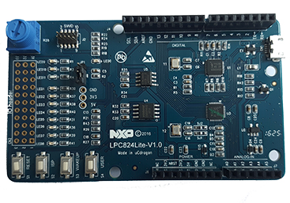

NXP LPC824Lite  MCUXpressoIDE LPCOpen Libary and Simples
======

[NXP LPC824Lite](http://www.ucdragon.cn/ProductsSt/250.html)  MCUXpressoIDE LPCOpen Libary base [LPCOpen for LPCXpresso824-MAX Board](https://www.nxp.com/cn/products/software-and-tools/hardware-development-tools/lpcxpresso-boards/lpcopen-software-development-platform-lpc8xx:LPCOPEN-SOFTWARE-FOR-LPC8XX?&tab=Design_Tools_Tab)

SDK/lpc8_chip_82x ->lpc82x chip Libary
SDK/lpc_board_lpc824lite ->LPC824Lite board Libary
SDK/blinky -> LED blink project
SDK/coremark ->coremark project
